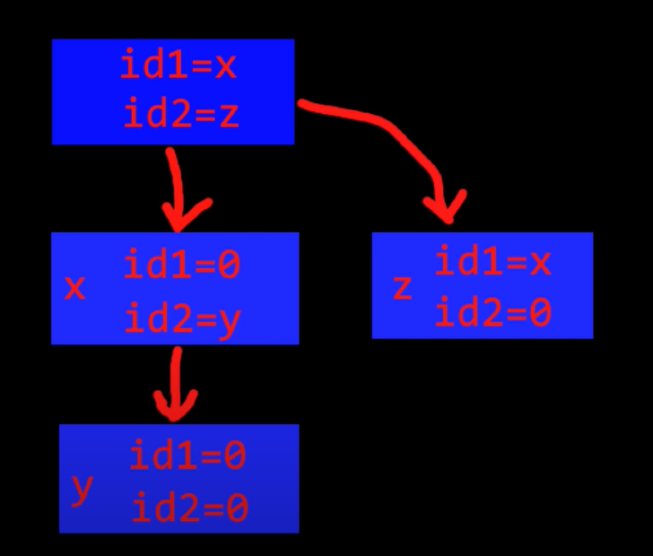

# Unix Processes in C

## Main Reference: *CodeVault*
 - https://youtube.com/playlist?list=PLfqABt5AS4FkW5mOn2Tn9ZZLLDwA3kZUY

## The fork() function in C

`#include <unistd.h>`

`number of processes = 2^(num of fork() calls)` <br>
`1 fork -> 2 process` <br>
`2 fork -> 4 process` <br>
`3 fork -> 8 process` <br>
`4 fork -> 16` <br>
`10 fork -> 1024` <br>
`20 fork -> 1048576` <br>

It's not recommended to use fork() in a loop - 2^n fork() calls

```cs
#include <stdlib.h>
#include <stdio.h>
#include <unistd.h>
#include <time.h>
#include <string.h>
#include <sys/wait.h>

int main()
{
    int id = fork();
    if (id == 0) {
        printf("Hello from child process\n");
    }
    else {
        printf("Hello from the parent process\n");
    }

    return 0;
}
```

```cs
#include <stdlib.h>
#include <stdio.h>
#include <unistd.h>
#include <time.h>
#include <string.h>
#include <sys/wait.h>

/**
 * Task: Create 3 processes only.
**/
int main()
{
    int id = fork();
    if (id != 0)
    {
        fork();
    }
    printf("Hi\n"); // prints "Hi" 3x
    return 0;
}
```
<br>

## Waiting for processes to finish (using the wait function) in C

```cs
#include <stdlib.h>
#include <stdio.h>
#include <unistd.h>
#include <time.h>
#include <string.h>
#include <sys/wait.h>

/**
 * Task: Print nums from 1 to 10
 * The child process prints 1-5
 * and the parent prints 6-10
**/
int main() {
    pid_t id = fork();
    int n;
    if (id == 0) { //Child process
        n = 1;
    }
    else {
        wait(NULL); //KEY! waits for the child process to finish printing 1-5
        n = 6;
    }
    
    for (int i = n; i <= n + 4; i++) {
        printf("%d ", i);
        fflush(stdout);
    }

    if (id > 0) {
        printf("\n");
    }

    return 0;
}
```

<br>

## Process IDs in C

```cs
#include <stdlib.h>
#include <stdio.h>
#include <unistd.h>
#include <time.h>
#include <string.h>
#include <sys/wait.h>

int main() {
    pid_t id = fork();
    // getpid() - current process ID
    // getppid() - parent process ID
    printf("Current ID: %d, parent ID: %d\n", getpid(), getppid());
    return 0;
}
```

<br>

```cs
#include <stdlib.h>
#include <stdio.h>
#include <unistd.h>
#include <time.h>
#include <string.h>
#include <sys/wait.h>

int main() {
    pid_t id = fork();
    if (id == 0) {
        sleep(1);
    }
    // getpid() - current process ID
    // getppid() - parent process ID
    printf("Current ID: %d, parent ID: %d\n", getpid(), getppid());

    int res = wait(NULL);
    if (res == -1) {
        printf("No children to wait for\n");
    }
    else {
        printf("%d finished execution\n", res);
    }

    return 0;
}
```

```cs
Current ID: 154, parent ID: 40
Current ID: 155, parent ID: 154
No children to wait for
155 finished execution
```

<br>

## Calling fork multiple times



```cs
#include <stdlib.h>
#include <stdio.h>
#include <unistd.h>
#include <time.h>
#include <string.h>
#include <sys/wait.h>
#include <errno.h>

int main() {
    pid_t id1 = fork();
    pid_t id2 = fork();
    if (id1 == 0) { //We're in the child of the parent process
        if (id2 == 0) { //We're in the child of that child process
            printf("We're in process [y]\n");
        }
        else { 
            printf("We're in process [x]\n");
        }
    }
    else {
        if (id2 == 0) {
            printf("We are process [z]\n");
        }
        else {
            printf("We are the parent process!\n");
        }
    }

    // To wait for all the processes we should wait for:
    while (wait(NULL) != -1 || errno != ECHILD) {
        printf("Waited for a child to finish\n"); // gets printed 3x
    }

    return 0;
}
```

<br>

## Communicating between processes (using pipes) in C

```cs
#include <stdlib.h>
#include <stdio.h>
#include <unistd.h>
#include <time.h>
#include <string.h>
#include <sys/wait.h>

/** Task:
 * Getting a number input from user int the child process,
 * and send that number to the main (parent) process. 
**/
int main() {
    int fd[2];
    // fd[0] - read
    // fd[1] - write

    if (pipe(fd) == -1) {
        printf("[ERROR]: An error occurred with opening the pipe\n");
        return 1;
    }

    // Be better fork() after creating the pipe!
    int id = fork();
    if (id == -1) {
        printf("[ERROR]: An error occurred while forking\n");
        return 2;
    }

    if (id == 0) {
        sleep(1); // wasting a bit of time
        close(fd[0]);
        int x;
        printf("Input a number: ");
        scanf("%d", &x);
        if (write(fd[1], &x, sizeof(int)) == -1) {
            printf("An error occurred with writing to the pipe\n");
            close(fd[1]); 
            return 3;
        }
        close(fd[1]); 
    }
    else {
        printf("Waited for child\n");
        close(fd[1]);
        int y;
        if (read(fd[0], &y, sizeof(int)) == -1) {
            printf("An error occurred with reading from the pipe\n");
            close(fd[0]); 
            return 4;
        }
        close(fd[0]);
        y *= 3;
        printf("Got from child process: %d\n", y);
        wait(NULL);
    }

    return 0;
}
```

<br>

## Practical use case for fork and pipe in C

```cs
#include <stdlib.h>
#include <stdio.h>
#include <unistd.h>
#include <time.h>
#include <string.h>
#include <sys/wait.h>

/** Task:
 * We want the sum of a array
 * one process calculates the first half another the second
 * and send the partial sum to the main process 
**/
int main() {
    int arr[] = {1, 2, 3, 4, 1, 2};
    int n = sizeof(arr) / sizeof(arr[0]);
    int start, end;
    int fd[2];
    if (pipe(fd) == -1) {
        printf("[ERROR]: An error occurred with opening a pipe\n");
        return 1;
    }

    pid_t id = fork();
    if (id == -1) {
        printf("[ERROR]: Fork failed\n");
        return 2;
    }

    if (id == 0) { // Child process
        start = 0;
        end = n / 2;
    }
    else {
        start = n / 2;
        end = n;
    }

    int sum = 0;
    for (int i = start; i < end; i++) {
        sum += arr[i];
    }

    printf("Calculated partial sum: %d\n", sum);

    return 0;
}
```

So far so good. <br>
Now we just need to send the information from one process to the another.

```cs
#include <stdlib.h>
#include <stdio.h>
#include <unistd.h>
#include <time.h>
#include <string.h>
#include <sys/wait.h>

/** Task:
 * We want the sum of a array
 * one process calculates the first half another the second
 * and send the partial sum to the main process 
**/
int main() {
    int arr[] = {1, 2, 3, 4, 1, 2};
    int n = sizeof(arr) / sizeof(arr[0]);
    int start, end;
    int fd[2];
    if (pipe(fd) == -1) {
        printf("[ERROR]: An error occurred with opening a pipe\n");
        return 1;
    }

    pid_t id = fork();
    if (id == -1) {
        printf("[ERROR]: Fork failed\n");
        return 2;
    }

    if (id == 0) { // Child process
        start = 0;
        end = n / 2;
    }
    else {
        start = n / 2;
        end = n;
    }

    int sum = 0;
    for (int i = start; i < end; i++) {
        sum += arr[i];
    }

    printf("Calculated partial sum: %d\n", sum);

    // If we're in the child, we send to information to the parent process
    if (id == 0) { 
        close(fd[0]);
        if (write(fd[1], &sum, sizeof(sum)) == -1) {
            printf("[ERROR]: Error occurred with writing the pipe\n");
            close(fd[1]);
            return 2;
        }
        close(fd[1]);
    }
    else {
        close(fd[1]);
        int sumFromChild = 0;
        if (read(fd[0], &sumFromChild, sizeof(int)) == -1) {
            printf("[ERROR]: Error occurred with reading the pipe\n");
            close(fd[0]);
            return 3;
        }
        close(fd[0]);

        int totalSum = sum + sumFromChild;
        printf("Total sum if %d\n", totalSum);
        wait(NULL);
    }

    return 0;
}
```

<br>

## Introduction to FIFOs (aka named pipes) in C

```cs
#include <stdio.h>
#include <unistd.h>
#include <stdlib.h>
#include <sys/types.h>
#include <sys/stat.h>
#include <sys/wait.h>
#include <fcntl.h> // to open fifo
#include <errno.h> // for errno, the number of last error

int main(int argc, char *argv[])
{
    char pipename[20];
    sprintf(pipename, "/tmp/%d", getpid());
    if (mkfifo(pipename, S_IRUSR | S_IWUSR) == -1) {
        if (errno != EEXIST) {
            printf("[ERROR]: with opening the fifo pipe\n");
            return 1;
        }
    }

    // FIFOs:
    // Opening the read or write end of a FIFO blocks until the other end is also opened
    // (by another process or thread)
    int fd = open(pipename, O_WRONLY); // so the terminal stops.
    int x = 97;
    if (write(fd, &x, sizeof(x)) == -1) {
        printf("[ERROR]: Error with writing the fifo pipe\n");
        return 2;
    }
    close(fd);

    return 0;
}

```

<br>

## How to use FIFO files to communicate between processes in C

```cs

```

<br>

## Two way communication between processes (using pipes) in C

Take a look at this code, looks nice. But..

```cs
#include <stdio.h>
#include <unistd.h>
#include <stdlib.h> 
#include <sys/types.h>
#include <sys/stat.h>
#include <fcntl.h>
#include <errno.h>
#include <sys/wait.h>

/** Task:
 * Generate a number [1-5], send to the other process
 * who multiplies the number by 4, and sends back
 * 5 =>
 * 5 * 4 = 20
 * => prints 20
**/ 
int main(int argc, char *argv[])
{
    int p1[2];
    if (pipe(p1) == -1) {
        printf("[ERROR]: Creating pipe\n");
        return 1;
    }

    pid_t pid = fork();
    if (pid == -1) {
        printf("[ERROR]: forking\n");
        return 2;
    }

    if (pid == 0) {//Child
        int x;
        if (read(p1[0], &x, sizeof(x)) == -1) {
            printf("[ERROR]: child - reading pipe\n");
            return 3;
        }
        printf("Received %d\n", x);

        x *= 4;
        if (write(p1[1], &x, sizeof(x)) == -1) {
            printf("[ERROR]: child - writing pipe\n");
            return 4;
        }
        printf("Wrote: %d\n", x);
    }
    else { //Parent
        int x = 5;
        if (write(p1[1], &x, sizeof(x)) == -1) {
            printf("[ERROR]: parent - writing pipe\n");
            return 5;
        }
        printf("Wrote: %d\n", x); 

        if (read(p1[0], &x, sizeof(x)) == -1) {
            printf("[ERROR]: parent - reading pipe\n");
            return 6;
        }
        printf("Result: %d\n", x);
        wait(NULL);
    }
    close(p1[0]);
    close(p1[1]);
    
    return 0;
}
```

Well.. this pretty code will not work properly.

**We cannot have a pipe that both sends and receives data!!!**

**We have to have 2 pipes in order to achieve this solution.**


Let's see:

```cs
#include <stdio.h>
#include <unistd.h>
#include <stdlib.h> 
#include <sys/types.h>
#include <sys/stat.h>
#include <fcntl.h>
#include <errno.h>
#include <sys/wait.h>

/** Task:
 * Generate a number [1-5], send to the other process
 * who multiplies the number by 4, and sends back
 * 5 =>
 * 5 * 4 = 20
 * => prints 20
**/ 
int main(int argc, char *argv[])
{
    int p1[2]; //child -> parent
    int p2[2]; //parent -> child

    // 0 - read ; 1 - write
    if (pipe(p1) == -1 || pipe(p2) == -1) {
        printf("[ERROR]: Creating pipe\n");
        return 1;
    }

    pid_t pid = fork();
    if (pid == -1) {
        printf("[ERROR]: forking\n");
        return 2;
    }

    if (pid == 0) { //Child
        close(p1[0]); //We don't need to read from the first pipe on the child process.
        close(p2[1]); //We don't need to write anything with the 2nd pipe
        int x;
        if (read(p2[0], &x, sizeof(x)) == -1) {
            printf("[ERROR]: child - reading pipe\n");
            return 3;
        }
        printf("Received %d\n", x);

        x *= 4;
        if (write(p1[1], &x, sizeof(x)) == -1) {
            printf("[ERROR]: child - writing pipe\n");
            return 4;
        }
        printf("Wrote: %d\n", x);

        close(p1[1]);
        close(p2[0]);
    }
    else { //Parent
        close(p1[1]);
        close(p2[0]);
        int x = 5;
        if (write(p2[1], &x, sizeof(x)) == -1) {
            printf("[ERROR]: parent - writing pipe\n");
            return 5;
        }
        printf("Wrote: %d\n", x); 

        if (read(p1[0], &x, sizeof(x)) == -1) {
            printf("[ERROR]: parent - reading pipe\n");
            return 6;
        }
        printf("Result: %d\n", x);

        close(p1[0]);
        close(p2[1]);
        wait(NULL);
    }

    return 0;
}
```

This guaranteed to always work.

<br>
<br>
<br>
<br>