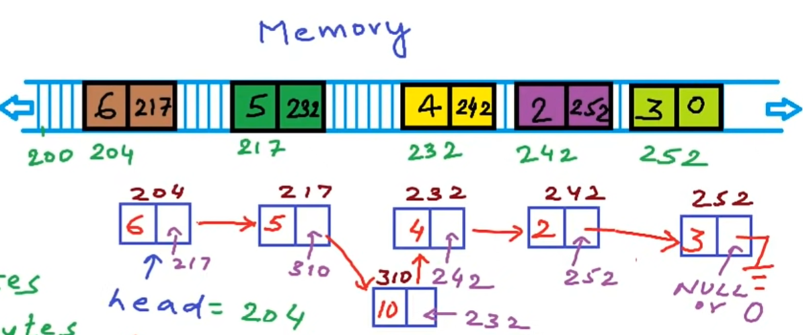
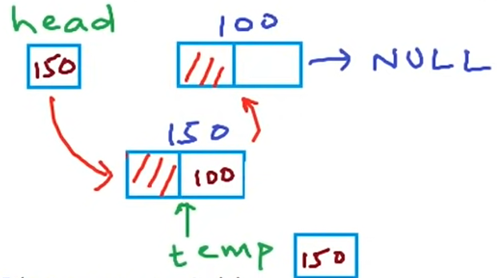
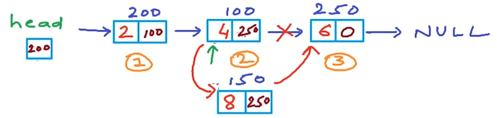
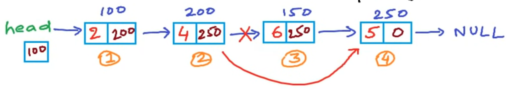
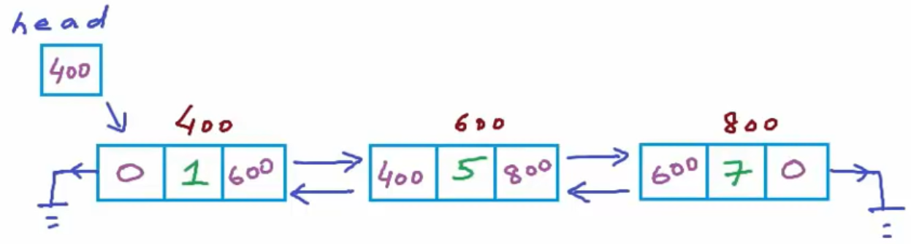
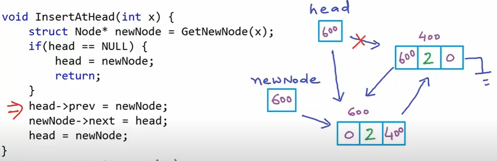

# Data Structures using C/C++

# Linked List

**Main Reference:**

- **mycodeschool:** https://www.youtube.com/playlist?list=PL2_aWCzGMAwI3W_JlcBbtYTwiQSsOTa6P


## List as abstract data type

- empty list has size 0
- insert
- remove
- count
- read/modify
- specify data-type

When array is full, we need to create a new larger array and copy all of the elements from the previous array. The solution to this problem is a linked list.

| operation | complexity |
| ---------- | ----------
| Read/Write | O(1) constant
| Insert | O(n) linear
| Remove | O(n)
| Add | O(n)

<br>

## Introduction to Linked List



```cpp
Struct Node {
    int data; // 4 bytes
    Node* next; // 4 bytes
}
```

**head** - address of the first head node gives us access of the complete list

| operation | complexity
| --------- | -----------
| Access element | O(n)
| Insertion | O(n)
|

<br>

## Inserting a Node at beginning



```cpp
// Linked List: Inserting a node at beginning
#include <stdio.h>
#include <stdlib.h>

typedef struct Node Node;
struct Node {
    int data;
    Node* next;
};

Node* head; // global var, can be accessed anywhere

void InsertBeginning (int x) {
    Node* temp = (Node*)malloc(sizeof(Node));
    temp->data = x;
    temp->next = head;
    head = temp;
}

void Print () {
    printf("List ist: ");
    Node* temp = head;
    while (temp != NULL) {
        printf("%d ", temp->data);
        temp = temp->next;
    }
    printf("\n");
}

int main()
{
    head = NULL; // empty list
    printf("How many numbers?\n");
    int n, x;
    scanf("%d", &n);
    for (int i = 0; i < n; i++) {
        printf("Enter a number: \n", &x);
        scanf("%d", &x);
        InsertBeginning(x);
        Print(x);
    }

    return 0;
}
```


<br>

## Insert a Node at *nth* position



```cpp
void InsertAt (int data, int position) {
    Node* temp1 = (Node*)malloc(sizeof(Node)); // new Node() in C++
    temp1->data = data;
    temp1->next = NULL;
    if (position == 1) {
        temp1->next = head;
        head = temp1;
        return;
    }

    Node* temp2 = head;
    for (int i = 1; i <= position - 2; i++) {
        temp2 = temp2->next;
    }

    temp1->next = temp2->next;
    temp2->next = temp1;
}

void Test_InsertAt() {
    head = NULL;    // empty list
    InsertAt(2, 1); // List: [2]
    InsertAt(3, 2); // List: [2, 3]
    InsertAt(4, 1); // List: [4, 2, 3]
    InsertAt(5, 2); // List: [4, 5, 2, 3]
    Print();
}
```

## Insert Node to the end (standard)

```cpp
void Insert (int data) {
    Node* newNode = (Node*)malloc(sizeof(Node));
    newNode->data = data;
    newNode->next = NULL;
    if (head == NULL) {
        head = newNode;
        return;
    }

    Node* temp = head;
    while (temp->next != NULL) {
        temp = temp->next;
    }
    temp->next = newNode;
}
```

<br>

## Delete a Node at *nth* position

1) Fix the links (.next)
2) Free the space



```cpp
void DeleteAt (int position) {
    Node* temp1 = head;
    if (position == 1) {
        head = temp1->next;
        free(temp1);
        return;
    }

    for (int i = 0; i < position - 2; i++) {
        temp1 = temp1->next;
    }
    Node* temp2 = temp1->next;
    temp1->next = temp2->next;
    free(temp2);
}

void Test_DeleteAt() {
    head = NULL;    // empty list
    Insert(2);
    Insert(4);
    Insert(6);
    Insert(5); 
    Print(); // List: [2, 4, 6, 5]
    int n;
    printf("Enter a position: \n");
    scanf("%d", &n);
    DeleteAt(n);
    Print();
}
```

<br>

## Reverse a Linked List

### Iterative method

```cpp
Node* ReverseIterative() {
    Node *current, *prev, *next;
    current = head;
    prev = NULL;
    while (current != NULL) {
        next = current->next;
        current->next = prev;
        prev = current;
        current = next;
    }
    head = prev;
    return head;
}
```

### Print Linked List Reverse - Recursion

Print elements of a linked list **in reverse order** using **recursion**

```cpp
void ReversePrint(Node* head) {
    if (head == NULL) return;
    PrintRecursion(head->next);
    printf("%d ", head->data);
}
```

### Reverse with Recursion
 
```cpp
Node* head; // global var, can be accessed anywhere

int main() {
    head = ReverseRecursion(head);
}

Node* ReverseRecursion(Node* head) {
    if (head == NULL || head->next == NULL) {
        return head;
    }
    Node* last = ReverseRecursion(head->next);
    head->next->next = head;
    head->next = NULL;
    return last;
}
```

## Full Code:

Can be found also in `LinkedList.c`

```cpp
#include <stdio.h>
#include <stdlib.h>

typedef struct Node Node; 
struct Node { // Node "class"
    int data;
    Node* next;
};
Node* head; // global var, can be accessed anywhere

// Operations
void Insert (int data); // Inserts at the end of the list.
void InsertBeginning (int data); // Inserts Node with value x to the beginning.
void InsertAt (int data, int position); // Inserts Node with value `x` at a given position.
void DeleteAt (int position); // Deletes Node at at a given position.
void Print (); // Prints Linked List.
void ReversePrint(Node*); // Print elements of a linked list in forward and reverse order using recursion

// Reversing
Node* ReverseIterative();
Node* ReverseRecursion(Node*);

// For testing methods
void Test_Insert ();
void Test_InsertBeginning (); 
void Test_InsertAt ();
void Test_DeleteAt ();

int main ()
{
    Test_Insert();
    // Test_InsertBeginning();
    // Test_InsertAt();
    // Test_DeleteAt();
    // Node* reversed1 = ReverseIterative();
    head = ReverseRecursion(head);

    //ReversePrint(head);
    Print();

    return 0;
}

void Insert (int data) {
    Node* newNode = (Node*)malloc(sizeof(Node));
    newNode->data = data;
    newNode->next = NULL;
    if (head == NULL) {
        head = newNode;
        return;
    }

    Node* temp = head;
    while (temp->next != NULL) {
        temp = temp->next;
    }
    temp->next = newNode;
}

void InsertBeginning (int data) {
    Node* temp = (Node*)malloc(sizeof(Node));
    temp->data = data;
    temp->next = head;
    head = temp;
}

void InsertAt (int data, int position) {
    Node* temp1 = (Node*)malloc(sizeof(Node)); // new Node() in C++
    temp1->data = data;
    temp1->next = NULL;
    if (position == 1) {
        temp1->next = head;
        head = temp1;
        return;
    }

    Node* temp2 = head;
    for (int i = 1; i <= position - 2; i++) {
        temp2 = temp2->next;
    }

    temp1->next = temp2->next;
    temp2->next = temp1;
}

void DeleteAt (int position) {
    Node* temp1 = head;
    if (position == 1) {
        head = temp1->next;
        free(temp1);
        return;
    }

    for (int i = 0; i < position - 2; i++) {
        temp1 = temp1->next;
    }
    Node* temp2 = temp1->next;
    temp1->next = temp2->next;
    free(temp2);
}

// Reversing
Node* ReverseIterative() {
    Node *current, *prev, *next;
    current = head;
    prev = NULL;
    while (current != NULL) {
        next = current->next;
        current->next = prev;
        prev = current;
        current = next;
    }
    head = prev;
    return head;
}

Node* ReverseRecursion(Node* head) {
    if (head == NULL || head->next == NULL) {
        return head;
    }
    Node* last = ReverseRecursion(head->next);
    head->next->next = head;
    head->next = NULL;
    return last;
}

// Test Methods:
void Print () {
    printf("List ist: ");
    Node* temp = head;
    while (temp != NULL) {
        printf("%d ", temp->data);
        temp = temp->next;
    }
    printf("\n");
}

void ReversePrint(Node* head) {
    if (head == NULL) return;
    ReversePrint(head->next);
    printf("%d ", head->data);
}

void Test_Insert () {
    head = NULL;
    Insert(2);
    Insert(4);
    Insert(6);
    Insert(5);
    Print(); // List: [2, 4, 6, 5]
}

void Test_InsertBeginning () {
    head = NULL; // empty list
    printf("How many numbers?\n");
    int n, x;
    scanf("%d", &n);
    for (int i = 0; i < n; i++) {
        printf("Enter a number: \n", &x);
        scanf("%d", &x);
        InsertBeginning(x);
        Print(x);
    }
}

void Test_InsertAt() {
    head = NULL;    // empty list
    InsertAt(2, 1); // List: [2]
    InsertAt(3, 2); // List: [2, 3]
    InsertAt(4, 1); // List: [4, 2, 3]
    InsertAt(5, 2); // List: [4, 5, 2, 3]
    Print();
}

void Test_DeleteAt() {
    head = NULL;    // empty list
    Insert(2);
    Insert(4);
    Insert(6);
    Insert(5); 
    Print(); // List: [2, 4, 6, 5]
    int n;
    printf("Enter a position: \n");
    scanf("%d", &n);
    DeleteAt(n);
    Print();
}
```

<br>

## Doubly Linked Lists



It's useful for a reverse look-up for example

```cpp
struct Node {
    int data;
    Node* next;
    Node* prev;
};
```



```cpp
#include <stdio.h>
#include <stdlib.h>

typedef struct Node Node;
struct Node {
    int data;
    Node* next;
    Node* prev;
};
Node* head; // global var - pointer to head Node.

void InsertAtHead(int data);
Node* GetNewNode(int data);
void ReversePrint();

void Print(Node*);
int main() {
    head = NULL;
    InsertAtHead(2);
    InsertAtHead(4);
    InsertAtHead(5);
    InsertAtHead(6); // List: [6, 5, 4, 2]

    ReversePrint(); // [2, 4, 5, 6]
    //Print(head);

    return 0;
}

void InsertAtHead(int data) {
    Node* newNode = GetNewNode(data);
    if (head == NULL) {
        head = newNode;
        return;
    }

    head->prev = newNode;
    newNode->next = head;
    head = newNode;
}

Node* GetNewNode(int data) {
    Node* newNode = (Node*)malloc(sizeof(Node));
    newNode->prev = NULL;
    newNode->data = data;
    newNode->next = NULL;
    return newNode;
}

void ReversePrint() {
    Node* temp = head;
    if (temp == NULL) return;

    while (temp->next != NULL) { // Going to last Node
        temp = temp->next;
    }

    // Traversing backward using prev pointer
    printf("Reverse: ");
    while(temp != NULL) {
        printf("%d ", temp->data);
        temp = temp->prev;
    }
    printf("\n");
}

void Print(Node* head) {
    if (head == NULL) return;
    printf("%d ", head->data);
    Print(head->next);
}
```

<br>
<br>
<br>
<br>
<br>