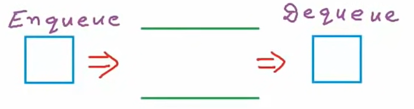
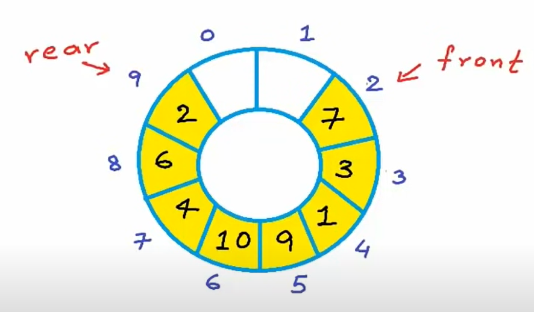

# Data Structures using C/C++

# Stack

**Main Reference:**

- **mycodeschool:** https://www.youtube.com/playlist?list=PL2_aWCzGMAwI3W_JlcBbtYTwiQSsOTa6P

<br>

## Introduction to Queues

Queue ADT - Abstract Data Type

- Insertion must happen in the tail of the queue

- Deletion must happen in the front of the queue

Operations

- Enqueue(x);

- Dequeue()

- Front() or Peek() first element in the queue

- IsEmpty()



<br>

## Implementation of Queues



```cpp
#include <stdio.h>
#include <stdlib.h>
#include <stdbool.h>

#define MAX_SIZE 101
int A[MAX_SIZE];
int front = -1;
int end = -1;

// To check whether Queue is empty or not
bool IsEmpty() {
    return front == -1 && end == -1;
}

// To check whether Queue is full or not
bool IsFull() {
	return (end + 1) % MAX_SIZE == front ? true : false;
}    

// Inserts an element in queue at rear end
void Enqueue(int data) {
    if (IsFull()) {
        printf("Error: Queue if Full\n");
        return;
    }
    if (IsEmpty()) {
        front = end = 0;
    }
    else {
        end = (end+1) % MAX_SIZE;
    }
    A[end] = data;
}

// Removes an element in Queue from front end.
void Dequeue() {
    if (IsEmpty()) {
        printf("Error: Queue is Empty\n");
        return;
    }
    
    if (front == end) {
        end = front = -1;
    }
    else {
        front = (front + 1) % MAX_SIZE;
    }
}

void Print() {
    // Finding number of elements in queue
    int count = (end + MAX_SIZE - front)  % MAX_SIZE + 1;
    printf("Queue: ");
    for (int i = 0; i < count; i++) {
        int index = (front + i) % MAX_SIZE; // Index of element while traversing circularly from front
        printf("%d ", A[index]);
    }
}

int main() {
    Enqueue(2);
    Enqueue(5);
    Enqueue(4);
    Dequeue();
    Enqueue(6);
    Print(); // 5 4 6

    return 0;
}
```

<br>

## Linked List implementation of Queue

```cpp
#include <stdlib.h>
#include <stdio.h>
#include <stdbool.h>

typedef struct Node Node;
struct Node {
    int data;
    Node* next;
};
Node* front = NULL;
Node* end = NULL;

bool IsEmpty() {
    return front == NULL && end == NULL;
}

void Enqueue(int x) {
    Node* temp = (Node*)malloc(sizeof(Node));
    temp->data = x;
    temp->next = NULL;
    if (IsEmpty()) {
        front = end = temp;
        return;
    }
    end->next = temp;
    end = temp;
}

void Dequeue() {
    Node* temp = front;
    if (front == end) {
        front = end = NULL;
    }
    else {
        front = front->next;   
    }
    free(temp);
}

void Print() {
    Node* temp = front;
    while (temp != NULL) {
        printf("%d ", temp->data);
        temp = temp->next;
    }
    printf("\n");
}

int main() {
    Enqueue(2);
    Enqueue(5);
    Enqueue(4);
    Dequeue();
    Enqueue(6);
    Print(); // 5 4 6

    return 0;
}
```

<br>
<br>
<br>
<br>