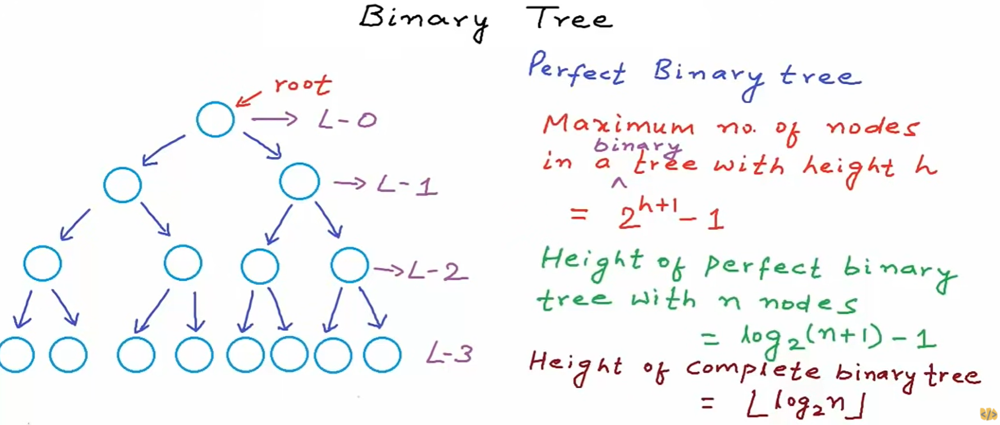

# Data Structures using C/C++

# Trees

**Main Reference:**

- **mycodeschool:** https://www.youtube.com/playlist?list=PL2_aWCzGMAwI3W_JlcBbtYTwiQSsOTa6P

<br>

## Introduction to Trees


Depth of x = No. of edges in path from root to x.

Height of x = No. of edges in the longest path from x to a leaf.

Height of tree = Height of root node

## Binary Tree


- a tree in which each node can have at most 2 children




We can implement binary tree using:

a) dynamically created nodes

b) arrays

<br>

## Binary Search Tree - BTS

- a binary tree in which for each node, value of all the nodes in left subtree is lesser or equal and value of all the nodes in right subtree is greater.

Implementation:

```cpp
#include <stdio.h>
#include <stdlib.h>
#include <stdbool.h>

// Binary Search Tree
typedef struct Node Node;
struct Node {
    int data;
    Node* left;
    Node* right;
};
/////////////////////

Node* GetNewNode(int data) {
    Node* newNode = (Node*)malloc(sizeof(Node));
    newNode->data = data;
    newNode->left = NULL;
    newNode->right = NULL;
    return newNode;
}

// To insert data in BST, returns address of root node 
Node* Insert(Node* root, int data) {
    if (root == NULL) { // empty tree
        root = GetNewNode(data);
    }
    // if data to be inserted is lesser, insert in left subtree.
    else if (data <= root->data) {
        root->left = Insert(root->left, data);
    }
    // else, insert in right subtree.
    else {
        root->right = Insert(root->right, data);
    }
    return root;
}

//To search an element in BST, returns true if element is found
bool Search(Node* root, int data) {
    if (root == NULL) return false;
    else if (data == root->data) return true;
    else if (data <= root->data) return Search(root->left, data);
    else return Search(root->right, data);
}

int main()
{
    Node* root = NULL; // Creating an empty tree
    /* Code to tes the logic*/
    root = Insert(root, 15);
    root = Insert(root, 10);
    root = Insert(root, 20);
    root = Insert(root, 25);
    root = Insert(root, 8);
    root = Insert(root, 12);
    int number = 25; // Found!
    // If number is found, print "Found"
    if (Search(root, number)) {
        printf("Found!\n");
    }
    else {
        printf("Not found\n");
    }    
}
```

## Find min and max element in a binary search tree

```cpp
// Find the minimum value in the BTS - iterative
int FindMin(Node* root) { // root is a local variable here
    // Node* current = root;
    if (root == NULL) {
        printf("Error: Tree is empty\n");
        return -1;
    }
    while (root->left != NULL) {
        root = root->left;
    }
    return root->data;
}

// Find the maximum value in the BTS - recursive
int FindMax(Node* root) {
    if (root == NULL) {
        printf("Error: Tree is empty\n");
        return -1;
    }
    else if (root->right == NULL) {
        return root->data;
    }

    // Search in right subtree.
    return FindMax(root->right);
}
```

## Find height of binary tree

Height of tree = Number of edges in the longest path from root to a leaf node


```cpp
int FindHeight(Node* root) {
    if (root == NULL) {
        return -1;
    }
    int a = FindHeight(root->left); // leftHeight
    int b = FindHeight(root->right); // rightHeight
    return (a > b ? a : b) + 1; // max(a, b) + 1
}
```

<br>

## Binary Tree Traversal - breadth-first and depth-first strategies

Tree Traversal = The process of visiting each node in the tree exactly once in some order.

### Breadth-first


### Depth-first

The order can be different.

- `<root> <left> <right>` - Preorder
- `<left> <root> <right>` - Inorder
- `<left> <right> <root>` - Postorder

#### Preorder (DLR) - data, left, right


#### Inorder (LDR) - left, data, right

`Inorder traversal of a BTS will give you a sorted list!`


#### Postorder (LRD) - left, data, right


## Binary tree: Level Order Traversal

We'll need a **Queue (FIFO)** for this strategy

|    | Complexity
| ----------- | -------------
| Time | `O(n)`
| Space | Best: `O(1)` <br> Worst/Avg: `O(n)`


```cpp
// C++
void LevelOrder(Node *root) {
	if(root == NULL) return;
	queue<Node*> Q;
	Q.push(root);  
	//while there is at least one discovered node
	while(!Q.empty()) {
		Node* current = Q.front();
		Q.pop(); // removing the element at front
		cout<<current->data<<" ";
		if(current->left != NULL) Q.push(current->left);
		if(current->right != NULL) Q.push(current->right);
	}
}
```

source code: https://gist.github.com/mycodeschool/9507131

## Preorder, Inorder, Postorder

Time-complexity = O(n)

Space-complexity = O(1) - best; O(n) - Worst/Avg

|            | Complexity 
| ----------- | -------------
| Time | `O(n)`
| Space | `O(height)` <br> Worst: `O(n)` <br> Best/Average: `O(log n)`

```cpp
void Preorder(Node* root) {
    if (root == NULL) return;
    printf("%d ", root->data); // Print data
    Preorder(root->left); // Visit left subtree
    Preorder(root->right); // Visit right subtree
}

void Inorder(Node* root) {
    if (root == NULL) return;
    Inorder(root->left); // Visit left subtree
    printf("%d ", root->data); // Print data
    Inorder(root->right); // Visit right subtree
}

void Postorder(Node* root) {
    if (root == NULL) return;
    Postorder(root->left); // Visit left subtree
    Postorder(root->right); // Visit right subtree
    printf("%d ", root->data); // Print data
}

int main() {
    Node* root = NULL; // Creating an empty tree
    /* Code to tes the logic */
    root = Insert(root, 15);
    root = Insert(root, 10);
    root = Insert(root, 20);
    root = Insert(root, 25);
    root = Insert(root, 8);
    root = Insert(root, 12);
    
    //              15
    //            /   \
    //          10     20
    //         /  \      \       
    //        8    12     25

    printf("\nPreorder: ");
    Preorder(root); // 15 10 8 12 20 25
    
    printf("\nInorder: ");
    Inorder(root); // 8 10 15 20 25 [SORTED!]
    
    printf("\nPostorder: ");
    Postorder(root); // 8 12 10 25 20 15
}    
```

<br>
<br>
<br>
<br>