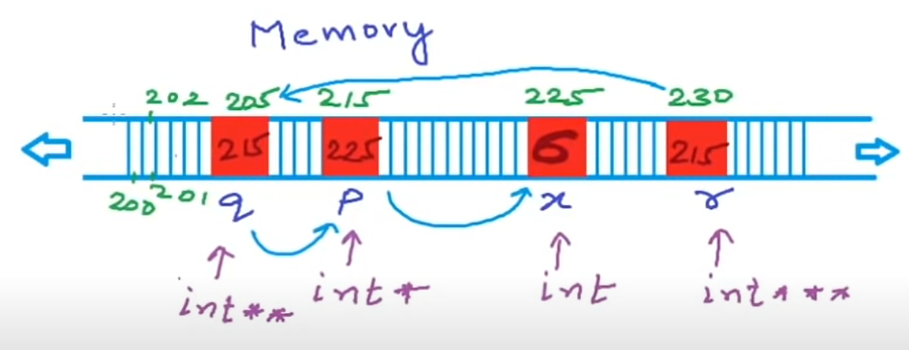
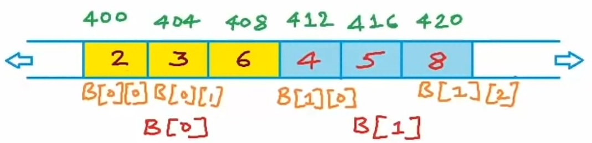
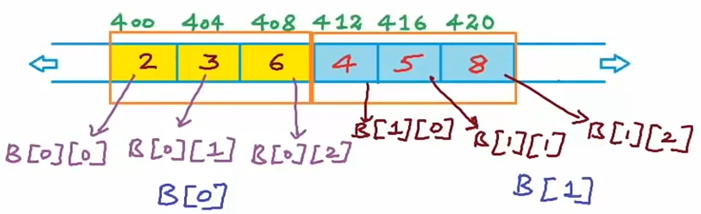
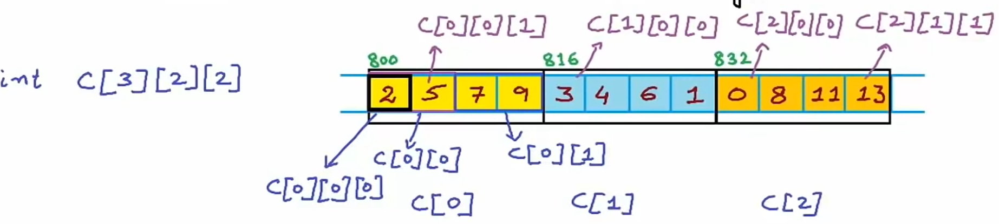
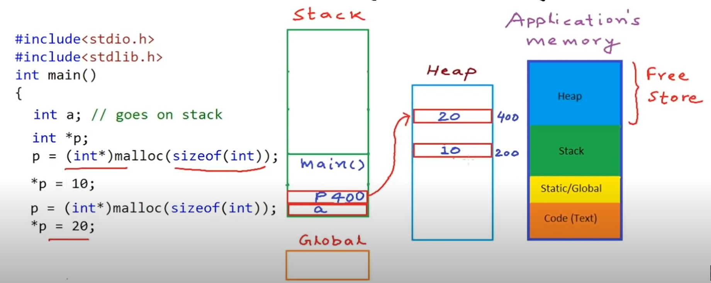
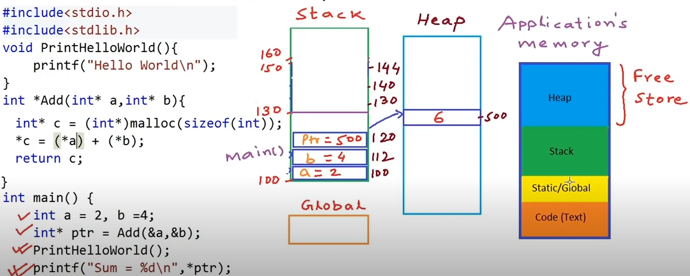

# C programming Pointers

source:
- https://www.youtube.com/user/mycodeschool
- https://www.youtube.com/watch?v=zuegQmMdy8M&t=6176s

## Compile and Run `.c` file

```
gcc main.c -o main
./main
```

## Pointer arithmetic

```java
include <stdio.h>
include <stdlib.h>

int main()
{
	int a = 10;
	int *p = &a;
	//Pointer arithmetic
	printf("Addres p is %d\n", p); //p is 2002
	printf("value at address p is %d\n", *p);
	printf("size of integer is %d bytes \n", sizeof(int));
	printf("Addres p+1 is %d\n", p+1);
	printf("value at address p+1 is %d\n", *(p+1)); //garbage

	return 0;
}
```

<br>

## Pointer types, void pointer, arithmetic

```java
int - 4 bytes
char - 1 bytes
float - 4 bytes

  byte3        byte2        byte1        byte0
[00000000]   [00000000]   [00000000]   [00000000]
    203         202           201         200       Address (fictional)

int a = 1025;
int *p = &a;
printf p //200
printf *p //look at 4 bytes starting from 200 -> value of 1025
```

<br>

```java
int a = 1025;
int *p = &a;
printf("size of integer is %d\n", sizeof(int));
printf("Address = %d, and value = %d\n",p,*p);
```

```java
int a = 1025;
int* p = &a;
printf("size of integer is %d\n", sizeof(int));
printf("Address = %d, and value = %d\n",p,*p);
//char *p0 = p //comp. error
char *p0 = (char*)p; //typecasting
printf("size of integer is %d bytes\n", sizeof(int));
printf("Address = %d, value = %d\n",p0,*p0);
1025 = 00000000 00000000 00000100 00000001 = [00000001] char
```

```java
int a = 1025;
int* p = &a;
printf("size of integer is %d\n", sizeof(int));
printf("Address = %d, and value = %d\n",p,*p);
printf("Address = %d, and value = %d\n",p+1,*(p+1));
//char *p0 = p //comp. error
char *p0 = (char*)p; //typecasting
printf("size of integer is %d bytes\n", sizeof(int));
printf("Address = %d, value = %d\n",p0+1,*(p0+1));
1025 = 00000000 00000000 [00000100] 00000001
```

### void pointer

```java
int a = 1025;
int* p = &a;
printf("size of integer is %d\n", sizeof(int));
printf("Address = %d, and value = %d\n",p,*p);
//Void pointer - Generic pointer
void *p0;
p0 = p; //Valid
printf("Address = %d, value = %d\n", p0, *p0, p0+1); // *p0; p0+1 -> Error; We can only print out Address
```

## Pointer to Pointer

```java
Memory 
                                    5
[   |   |   |   |   |   |   | x | x | x | x |   |   |   ]
200 201 202
int x = 5;
int *p
p = &x;
*p = 6;
int** q;
q = &p;
int*** r;
r = &q;
```



### Code:

```java
int x = 5;
int* p = &x;
*p = 6;
int** q = &p;
int*** r = &q;

printf("%d\n", *p); //-> 6
// printf("%d\n", *q); //-> 225
// printf("%d\n", **q); //-> 6

printf("%d = %d\n", *r,&p);
printf("%d\n", **r); //-> 215
printf("%d\n", ***r); //-> 6
***r = 10;
printf("x= %d\n",x); //-> 10
**q = *p +2;
printf("x= %d\n",x); //-> 12
```

## Pointers as function arguments - Call by reference

```java
include <stdio.h>
        
void increment(int *a){
    //*a = *a + 1;
    (*a)++;
}

int main()
{
    int a = 10;
    increment(&a);
    printf("%d\n",a);
}
```

## Pointers and Arrays

```java
Address - &A[i] or (A+i)
Value - A[i] or *(A+i)
        
int A[] = {2,4,5,8,1};
A++; // invalid
p++; // valid
printf("%d\n",A);
printf("%d\n",&A[0]);
printf("%d\n",A[0]);
printf("%d\n", *A);

int i;
for(i=0; i<5; i++){
    printf("Address= %d; ", &A[i]);
    printf("Address= %d\n", A[i]); //*(A+i);
}

```

## Arrays as function arguments

✅

```java
include <stdio.h>

int sumOfElements(int A[], int size)
{
    int s = 0;
    for(int i=0; i < size; i++){
      
        s += A[i];
    }

    return s;
}
   
int main()
{
    int A[] = {1,2,3,4,5};
    int size = sizeof(A)/sizeof(A[0]);
    int total = sumOfElements(A,size);

    printf("Sum of elements = %d\n",  total); // 15

    return 0;
}
```

<br>

❌

```java
include <stdio.h>

int sumOfElements(int A[]) // interpreted as => int* A 
{
    int s = 0;
    // this will not work since sizeof(A) is 4 bcs it's an int,
    // while in the main method A is an array.
    for(int i=0; i < sizeof(A[])/sizeof(A[0]); i++){ 
      
        s += A[i];
    }

    return s;
}
   
int main()
{
    int A[] = {1,2,3,4,5};
    int total = sumOfElements(A);

    printf("Sum of elements = %d\n",  total); // 15

    return 0;
}
```

**Always pass the array size as a function parameter!**

```java
include <stdio.h>

void Double(int* A, int size) // "int* A" or "int A[]" ..it's the same"
{
    int sum = 0;
    for (int i = 0; i < size; i++) {
        A[i] = 2 * A[i];
    }
}

int main() {
    int A[] = {1, 2, 3, 4, 5};
    int size = sizeof(A)/sizeof(A[0]);
    Double(A, size);
    for (int i = 0; i < size; i++) {
        printf("%d ", A[i]); // Elements are doubled as expected
    }
}
```


<br>

## Character array (Strings) and pointers

1. How to store String
    
size of array >= no. of characters in string + 1  <br>
```java
"John" Size >= 5
char c[4];
c[0] = 'J', c[1] = 'O'; c[2] = 'H'; c[3] = 'N'; 
c[4] = '\0'
Rule : - A string in C has to be null terminated

        include <stdio.h>
        include <string.h>

        int main()
        {
            char c[20];
            c[0] = 'J';
            c[1] = 'O';
            c[2] = 'H';
            c[3] = 'N';
            c[4] = '\0';
            int len = strlen(c);
            printf("Length = %d\n", len); // 4

            return 0;
        }
```

2. Arrays and pointers are different types that are used in similar manner

```java
char c1[6] = "Hello";
char* c2;
c2 = c1; ✅
//c1 = c2; ❌
print c2[1]; // e
c2[0] = 'A'; // "Aello"
```

3. Arrays are always passed to function by reference

```java
include <stdio.h>

void print(const char* c)
{
    //int i = 0;
    while(*c != '\0'){ // c[i] != '\0'
        printf("%c", *c);
        c++;
        //printf("%c", c[i]);
        //i++;
    }
    printf("\n");
}

int main()
{
    char c[20] = "Hello";
    print(c);
    printf("%d\n",c); // Address

    return 0;
}
```

## Character arrays and pointers - part 2

```java
char c[20] = "Hello"; // string gets stored in the space for array (stack)
char *c = "Hello"; // string gets stored as compile time costant, cannot be modified
c[0] = 'A'; ❌
```

## Pointers and Matrix



```java
int B[2][3];
B[0]; B[1] -> 1-D arrays of 3 integers
int *p = B; -> will return a pointer to 1-D array of 3 integers
int (*P)[3] = B;✅
print B or &B[0] // 400
print *B or B[0] or &B[0][0] // 400
print B+1; // 400 + size of 1-D array of 3 integers in bytes = 412
print *(B+1) or B[1] or &B[1][0] // 412
print *(B+1)+2 or B[1]+2 // 420
print *(*B+1); // 3

B[i][j] = *(B[i] + j)
*(B[i] + j) = *(*(B+i)+j);
```



```java
int B[2][3];
int (*p)[3] = B;✅
//int *p = B; ❌
print B // 400
Print *B // 400
print B[0] // 400
print &B[0][0] // 400
```

## Pointers and multi-dimensional arrays



```java
int c[3][2][2];
int (*p)[2][2] = c;

print c; // 800
print *c or c[0] or &c[0][0] // 800
c[i][j][k] = *(c[i][j] + k)
= *(*(c[i]+j)+k)
= *(*(*(c+i)+j)+k)

print *(c[0][1] + 1); // 9
print *(c[1] + 1); // 824
```

```java
include <stdio.h>
void func(int A[][2][2])
{

}
int main()
{
    int c[3][2][2] = {
                        {{2,5},{7,9}},
                        {{3,4},{6,1}},
                        {{0,8},{11,13}}
                     };

    printf("%d %d %d %d\n", c, *c, c[0], &c[0][0]); // all the same
    printf("%d\n", *(c[0][0]+1)); // 5
        
    func(c);
}
```

## Pointers and dynamic memory

C (functions)
* malloc
* calloc
* realloc
* free

c++ (operators)
* new
* delete

<br>

  

```java
include <stdio.h>
include <stdlib.h>

int main()
{
    int a; // goes on stack
    int *p = (int*)malloc(sizeof(int));
    *p = 10; 
    free(p);

    p = (int*)malloc(sizeof(int));
    *p = 20;

    return 0;
}
```

to make array on the heap:

```java
p = (int*)malloc(20*sizeof(int)); // int array of 20 elements
// p will point to the base address of the array block
```

## malloc, calloc, realloc, free; pointers + functions

```java
malloc - void* malloc( size_t size)
void *p = malloc(sizeof(int));
print p // 208
*p = 2;
*(p+1) = 4;
*(p+2) = 6;
```

```java
calloc - void* calloc(size_t num, size_t size);
int *p = (int*)calloc(3,sizeof(int));
```

```java
realloc - void* realloc(void* tr, size_t size);
```

Read array size from the user:

```java
include <stdio.h>
include <stdlib.h>

int main()
{
    int n;
    printf("Enter size of array\n");
    scanf("%d",&n);
    int *A = (int*)malloc(n*sizeof(int)); // dynamically allocated array
    int *A = (int*)calloc(n,sizeof(int)); // dynamically allocated array

    for(int i = 0; i < n; i++){
        A[i] = i+1;
    }

    for(int i = 0; i < n; i++){
        printf("%d ", A[i]);
    }

    return 0;
}
```

When ```malloc``` isn't inicialized, all array variable is a memory garbage; <br>
with ```calloc``` every array variable is inicialized ```0```

To free the heap memory:

```java
for(int i = 0; i < n; i++){
        A[i] = i+1;
    }

    free(A);
    A = NULL; // After free, adjust pointer to NULL

    for(int i = 0; i < n; i++){
        printf("%d ", A[i]);
    }
```

If we want to modify the ```size``` of the ```array```, we use ```realloc```:

```java
include <stdio.h>
include <stdlib.h>

int main()
{
    int n;
    printf("Enter size of array\n");
    scanf("%d",&n);
    //int *A = (int*)calloc(n,sizeof(int));
    int *A = (int*)malloc(n*sizeof(int));

    for(int i = 0; i < n; i++){
        A[i] = i+1;
    }

    //int *B = (int*)realloc(A, 2*n*sizeof(int)); // increase array size
    //int *B = (int*)realloc(A, (n/2)*sizeof(int)); // reduce array size
    //int *B = (int*)realloc(A, 0); // free(A);
    int *B = (int*)realloc(NULL, n*sizeof(int)); // equivalent to malloc
    printf("Prev block Address = %d, new Address = %d\n",A,B);

    for(int i = 0; i < n; i++){
        printf("%d ", B[i]);
    }

    return 0;
}
```

## Pointers as function returns



❌:

```java
#include <stdio.h>
#include <stdlib.h>

int *add(int* a, int* b)
{
    int c = (*a) + (*b);
    return &c;
}

int main()
{
    int a = 2, b = 4;
    int* ptr = add(&a, &b);
    printf("sum= %d\n",*ptr);

    return 0;
}
```

✅

```java
#include <stdio.h>
#include <stdlib.h>

int *add(int* a, int* b)
{
    int* c = (int*)malloc(sizeof(int));
    *c = (*a) + (*b);
    return c;
}

int main()
{
    int a = 2, b = 4;
    int* ptr = add(&a, &b);
    printf("sum= %d\n",*ptr);

    return 0;
}
```

## Function pointers

**Pointers**
 * Can point to data
 * Can point to functions

```java
include <stdio.h>
include <stdlib.h>

int add(int a, int b)
{
    return a+b;
}

int main()
{
    // pointer tp function that should take
    // (int,int) as argument/paramteter and return int
    int (*p)(int,int);
    //void (*p)(int,int); // void function
    int c;
    p = &add; // p = add would be the same
    //c = (*p)(2,3);
    c = p(2,3); // de-referencing and executing the function
    printf("%d\n",c);

    return 0;
}
```

```java
include <stdio.h>

void printHello(char *name)
{
    printf("Hello %s\n",name);
}

int main()
{
    void (*ptr)(char*);
    ptr = printHello;
    ptr("Gyula");

    return 0;
}
```

## Function pointers and callbacks

```java
include <stdio.h>

void a(){
    printf("Hello\n");
}
void b(void (*ptr)()) // function pointer as argument
{
    ptr(); // call-back function that "ptr" points to
}

int main()
{
    //void (*p)() = a;
    //b(p);
    b(a);
    
    return 0;
}
```

```java
include <stdio.h>
// callback function should compare two integers, should return 1 if first element has higher rank,
// 0 if elements are equal and -1 if second element has higher rank
int compare(int a, int b)
{
    return a > b ? -1 : 1;
}
void sort(int v[], int n, int (*compare)(int,int))
{
    for(int i=0; i<n-1; i++){
        for(int j=0; j<n-i-1; j++){
            if(compare(v[j], v[j+1]) > 0){
                int temp = v[j];
                v[j] = v[j+1];
                v[j+1] = temp;
            }
        }
    }

}
int main()
{
    int A[] = {3,2,1,5,6,4};
    sort(A,6,compare);
    for(int i=0; i<6; i++){
        printf("%d ", A[i]);
    }
}
```

```java
include <stdio.h>
include <math.h>
include <stdlib.h>

int compare(const void* a, const void* b)
{
    int A = *((int*)a);
    int B = *((int*)b);
    return A-B;
}
int main(){
    int i, A[] = {-31,22,-1,50,-6,4};
    qsort(A,6,sizeof(int), compare);
    for(int i=0; i<6; i++){
        printf("%d ", A[i]);
    }
}
```

## Memory leak

```java
include <stdio.h>
include <stdlib.h>
include <time.h>

int cash = 100;

void play(int bet)
{
    //char c[3] = {'J','Q','K'};
    char *c = (char*)malloc(3*sizeof(char)); /////////////
    c[0] = 'J';
    c[1] = 'Q';
    c[2] = 'K';
    printf("Shuffling...\n");
    srand(time(NULL));
    for(int i=0; i<5; i++){
        int x = rand() % 3;
        int y = rand() % 3;
        int temp = c[x];
        c[x] = c[y];
        c[y] = temp;
    }
    int playersGuess;
    printf("What's the position of queen - 1,2 or 3?  ");
    scanf("%d", &playersGuess);
    if(c[playersGuess - 1] == 'Q'){
        cash += 3*bet;
        printf("You Win! Result = %c%c%c Toal Cash= %d\n", c[0],c[1],c[2],cash);
    }
    else{
        cash -= bet;
        printf("You Loose! Result = %c%c%c Toal Cash= %d\n", c[0],c[1],c[2],cash);
    }

    free(c); /////////////
}

int main()
{
    int bet;
    printf("**Welcome to the Virtual Casino**\n\n");
    printf("Total cash = $%d\n",cash);
    while(cash > 0){
        printf("What is your bet? $");
        scanf("%d", &bet);
        if(bet == 0 || bet > cash){
            break;
        }
        play(bet);
        printf("\n***************************************\n");
    }
}

```

<br>
<br>